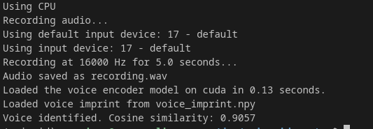
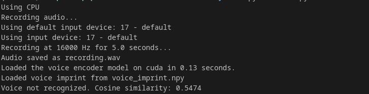

# Voice ID System

Voice ID System is a Python-based speaker recognition system that allows you to enroll your voice and later identify it from new recordings. It leverages modern speaker embedding techniques using [Resemblyzer](https://github.com/resemble-ai/Resemblyzer) to extract robust voice features. The system is designed in a modular way for future enhancements and supports CPU, NVIDIA GPU, and AMD GPU configurations.

## Features

- **Enrollment Mode:** Record a sample of your voice, extract a speaker embedding, and save it as your voice imprint.
- **Identification Mode:** Record a new sample and compare its embedding with the enrolled voice imprint using cosine similarity.
- **Device Auto-Selection:** Automatically selects a working audio input device or allows manual selection via a command-line option.
- **CPU/GPU Support:** Runs on CPU by default; supports NVIDIA and AMD GPUs if available.
- **Modular Design:** Easily extend or enhance the system (e.g., integrate advanced deep learning models) with separate modules.

## Project Structure

```
voice-id-system/
 ├── main.py               # Main entry point for enrollment and identification.
 ├── audio_recorder.py     # Module for recording audio and selecting the input device.
 ├── voice_imprint.py      # Module for extracting and comparing voice embeddings.
 ├── model.py              # Placeholder for future deep learning model integration.
 └── requirements.txt      # Python package dependencies.
```

## Requirements

### Python Packages

This project requires Python 3.8 or higher and the following Python packages:

- **torch** (for GPU support, if applicable)
- **torchaudio**
- **librosa**
- **numpy**
- **sounddevice**
- **scipy**
- **resemblyzer**

Install them via pip using the provided `requirements.txt` file:

```bash
pip install -r requirements.txt
```

### System Dependencies (Linux)

For audio recording support, install the necessary system libraries. On Ubuntu/Pop!_OS (or other Debian-based systems), run:

```bash
sudo apt-get install portaudio19-dev libasound-dev
```

If your system uses Pipewire (default on many modern distros), ensure you have the compatibility packages installed:

```bash
sudo apt install pipewire-alsa
```

## How It Works

1. **Enrollment Mode (`--mode enroll`):**
   - Records your voice sample using your default (or a specified) audio input device.
   - Saves the raw audio as `recording.wav` (for reference).
   - Extracts a speaker embedding from the audio using Resemblyzer.
   - Saves the embedding (your voice imprint) to `voice_imprint.npy`.

2. **Identification Mode (`--mode identify`):**
   - Records a new audio sample.
   - Saves the sample as `recording.wav`.
   - Extracts a speaker embedding from the new recording.
   - Loads the saved voice imprint from `voice_imprint.npy`.
   - Compares the two embeddings using cosine similarity.
   - Reports whether the voice is identified based on a configurable threshold (default is 0.75).

3. **Device Selection:**
   - The system first attempts to use the default audio input device.
   - If the default device fails, it scans for available working devices and prompts you to choose one.
   - You can explicitly specify an audio device index with the `--audio-device` option.

4. **CPU, NVIDIA, AMD Support:**
   - The program runs on CPU by default.
   - Use the `--device` option (`cpu`, `nvidia`, or `amd`) to indicate your preferred computing device. The system will check GPU availability using PyTorch and fall back to CPU if necessary.

## Installation

1. **Clone the repository:**

   ```bash
   git clone https://github.com/subhashdasyam/voice-id-system.git
   cd voice-id-system
   ```

2. **Install Python dependencies:**

   ```bash
   pip install -r requirements.txt
   ```

3. **Install system dependencies (Linux):**

   ```bash
   sudo apt-get install portaudio19-dev libasound-dev
   ```
   And if using Pipewire:
   ```bash
   sudo apt install pipewire-alsa
   ```

## Usage

### Enroll Your Voice

Enroll your voice to create a voice imprint. This command records 10 seconds of audio, extracts the speaker embedding, and saves it:

```bash
python main.py --mode enroll --duration 10 --device nvidia
```

*Note:* If you need to specify a particular audio device, use the `--audio-device` flag (e.g., `--audio-device 2`).

### Identify Your Voice

Identify or verify your voice by comparing a new recording with the enrolled imprint:

```bash
python main.py --mode identify --duration 5
```

The program records 5 seconds of audio, extracts the speaker embedding, and compares it with the saved imprint using cosine similarity.


# Voice ID System Enhancements

This enhancement integrates state-of-the-art deep learning models for more robust speaker recognition. The original system used Resemblyzer for speaker embeddings, but now includes two additional advanced models:

## X-vectors

X-vectors are speaker embeddings derived from Time Delay Neural Networks (TDNNs) that offer several advantages:

- **Temporal Modeling**: Better captures time-dependent patterns in speech
- **Noise Robustness**: More resilient to background noise and recording conditions
- **Variable-Length Processing**: Effectively handles utterances of different durations
- **Discriminative Power**: Produces more distinctive speaker representations

## D-vectors

D-vectors (deep vectors) are neural embeddings extracted using LSTM-based networks that:

- **End-to-End Learning**: Learn speaker characteristics directly from speech features
- **Context Awareness**: Capture long-range dependencies in speech
- **Fixed-Dimensional Output**: Create standardized embedding space for comparison
- **Adaptability**: Can be fine-tuned for specific speaker populations

## System Changes

The enhanced system includes the following changes:

1. New `advanced_models.py` module implementing both x-vector and d-vector architectures
2. Updated `voice_imprint.py` with support for multiple embedding models
3. Modified `main.py` with additional command-line options
4. Expanded requirements for the additional dependencies

## Usage

### Multi-Sample Enrollment

The system now supports collecting multiple voice samples during enrollment for more robust recognition:

```bash
# Enroll with 5 samples of 10 seconds each using x-vector model
python main.py --mode enroll --model xvector --device nvidia --samples 5 --duration 10
```

### Identification

```bash
# Identify using the same model type used for enrollment
python main.py --mode identify --model xvector --duration 5
```

## Technical Notes

1. **Thresholds**: Different embedding types may require different similarity thresholds:
   - Resemblyzer: 0.75 (default)
   - X-vectors: 0.70 (generally lower)
   - D-vectors: 0.75 (similar to Resemblyzer)

2. **Performance Considerations**:
   - Advanced models require more computational resources
   - GPU acceleration is recommended for faster processing
   - First-time model initialization may take longer

3. **Compatibility**:
   - Enrollments store the model type used, enabling proper comparison
   - Cross-model comparisons are possible but may reduce accuracy
   - It's best to use the same model for both enrollment and identification

## Benefits of Multiple Samples

Using multiple voice samples during enrollment offers significant advantages:

1. **Improved Robustness**: Captures more variations in the speaker's voice
2. **Reduced Sensitivity**: Less affected by individual recording anomalies
3. **Better Coverage**: Samples different speaking patterns and characteristics
4. **Higher Accuracy**: Typically results in fewer false accepts/rejects

## Future Work

1. **Pretrained Models**: Add capability to download and use pretrained models from public repositories
2. **Fine-tuning**: Enable fine-tuning on user-specific data for better performance
3. **Model Fusion**: Combine multiple embedding types for enhanced accuracy
4. **Data Augmentation**: Implement audio augmentation to improve model robustness
5. **Active Learning**: Implement a system to continuously improve voice imprints with new samples

# Solving the Microphone Distance Problem

This guide explains how to solve the common issue where voice recognition works when the microphone is at the same distance as during enrollment, but fails when the distance changes.

## Understanding the Problem

When you enroll with the microphone close to your mouth but identify with it further away (or vice versa), the acoustic properties of your voice change significantly:

- **Close microphone**: Captures more bass frequencies, stronger volume, less room acoustics
- **Far microphone**: Captures more room acoustics, lower volume, more environmental noise

These differences can cause the voice embeddings to differ enough that the system fails to recognize you, even though it's the same person speaking.

## Solution: Multi-Distance Enrollment

The Voice ID System now includes two key enhancements to solve this problem:

1. **Multi-Distance Enrollment**: Records samples at different microphone distances
2. **Audio Preprocessing**: Normalizes audio to reduce the impact of microphone distance

## How to Use Multi-Distance Enrollment

1. When enrolling a user, select "yes" when prompted about multi-distance enrollment:
   ```
   Would you like to use multi-distance enrollment (more robust)? (y/n): y
   ```

2. Follow the instructions to alternate between:
   - **Close microphone**: Normal speaking distance
   - **Far microphone**: Approximately twice the normal distance

3. The system will:
   - Record your samples at alternating distances
   - Create additional processed variants of each sample
   - Build a voice imprint that works at multiple distances

## Audio Preprocessing Features

The system now automatically applies these preprocessing techniques:

1. **Volume Normalization**: Makes quiet and loud recordings more similar
2. **Frequency Equalization**: Reduces the impact of microphone distance on frequency response
3. **Noise Reduction**: Reduces background noise that may interfere with recognition
4. **Distance Simulation**: Creates synthetic variants of your voice at different distances

## Tips for Best Results

1. **Use at least 6 samples**: More samples mean better coverage of different conditions
2. **Vary your speech**: Use different phrases, tones, and speaking styles
3. **Vary distance meaningfully**: Make sure to position the microphone at noticeably different distances
4. **Consider the environment**: If possible, enroll in the same environment where you'll be identifying

## Technical Background

The multi-distance enhancement works through:

1. **Feature space expansion**: By including samples at different distances, we expand the feature space of what "your voice" means to the system
2. **Signal processing**: Audio preprocessing normalizes key aspects of the signal that vary with distance
3. **Data augmentation**: The system generates additional variants to fill in gaps between distances

## Troubleshooting

If you're still experiencing issues with microphone distance:

1. Re-enroll with more extreme distance variations
2. Try using the `--strict false` option during identification to lower the threshold slightly
3. Consider your microphone quality - some microphones are more sensitive to distance than others

## Troubleshooting

- **Audio Device Issues:**  
  If you encounter errors with the default audio device, list available devices with:

  ```bash
  python -c "import sounddevice as sd; print(sd.query_devices())"
  ```

  Then, use the `--audio-device` option to specify a working device index.

- **Permission Issues:**  
  Ensure your user account has the necessary permissions to access audio devices.

- **Threshold Tuning:**  
  If identification results are not as expected (false accepts or rejects), adjust the cosine similarity threshold in `voice_imprint.py` within the `compare_imprint` function.

- **GPU vs. CPU:**  
  The `--device` option only affects PyTorch device selection. If GPU is not available, the system automatically falls back to CPU.

## Example




## Future Enhancements

- **Improved Speaker Verification Models:**  
  Integrate advanced deep learning models (e.g., x-vectors, d-vectors) for more robust recognition.
- **Multiple Enrollment Samples:**  
  Allow multiple recordings during enrollment to create a more robust voice imprint.
- **Cross-Platform Testing:**  
  Expand testing and optimization for Windows and macOS.

## License

MIT

## Acknowledgements

- **Resemblyzer:** For providing a robust framework for speaker embedding extraction.
- **Open-source Community:** For the excellent libraries and tools that make this project possible.